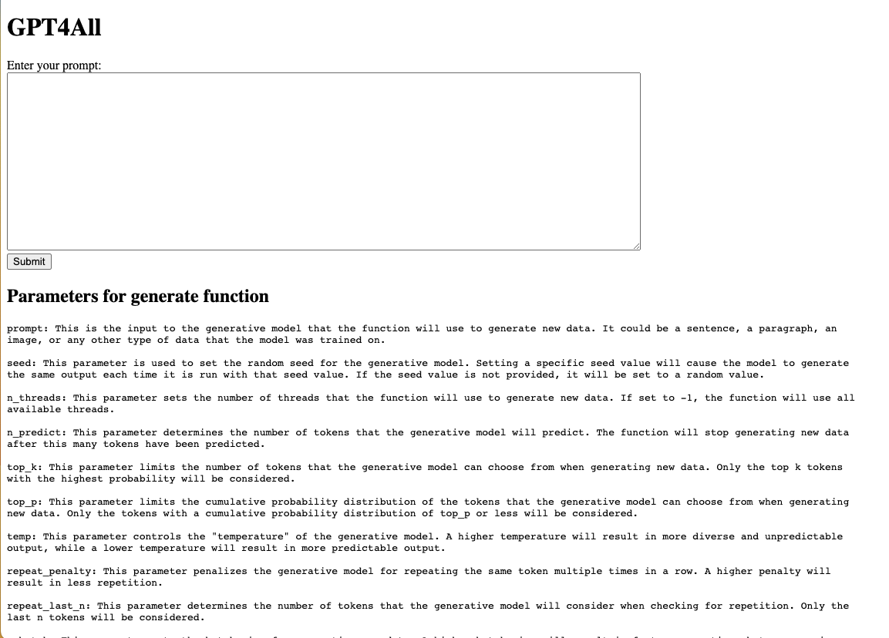

# GPT4ALL playground

You will need to download a model from https://gpt4all.io/ and add it to `models/` folder in the root of the project

## Running

Running the app.py will host a flask app @ http://127.0.0.1:5000

## UI

UI is is minimal and looks like this:

